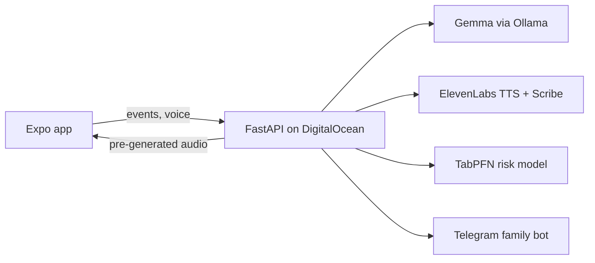

*This is a submission for the [Hacktoberfest Weekend Challenge: Build for a Friend](https://dev.to/challenges/hacktoberfest-weekend-2026-10-01)*

## What I Built

<!-- TODO: the story. Who is {PERSON}? What do they take, when? What went wrong before (forgotten doses, double doses, family worrying from afar)? Why a pill-box alarm was not enough. Keep it personal and specific. -->

Couchy is a mobile app with a warm AI companion. At each dose it speaks to {PERSON} in a voice they chose, they can answer out loud ("I already took it after breakfast", "I feel a bit dizzy"), and their family gets Telegram alerts and a spoken weekly postcard when something looks off.

## Demo

<!-- TODO: video (<= 2 min, narrated with ElevenLabs), GIFs: reminder screen, voice reply, Telegram alert, weekly postcard -->

## What {PERSON} said

<!-- TODO: their reaction, a quote, a photo of them using it. This is the "hand it over" bonus. -->

## Code

<!-- TODO: embed the GitHub repo:  -->

## How I Built It

- **Gemma is the brain.** It writes ten personalized reminders per medication (using the person's name, family and routine), classifies what {PERSON} says (`taken | snooze | skip | concern | chat`) with structured JSON output, drafts family alerts and writes the weekly report. It never computes numbers and never gives medical advice; every call has a fixed template fallback.
- **Voice that works offline.** Reminders are generated and voiced ahead of time, then cached on the phone, so the companion speaks even with no internet.
- **ElevenLabs** voices the companion (`eleven_v3`, with audio tags like `[warmly]`), transcribes spoken replies with Scribe, and narrated this demo.
- **Analytics are plain pandas**: adherence, punctuality, delay, consistency, response time. The LLM only phrases them.
- **TabPFN** predicts which upcoming doses are likely to be late, from a few dozen past doses.
- **DigitalOcean** hosts the API and Gemma (Docker Compose, Caddy for HTTPS).
- **Telegram** delivers alerts: missed dose (after a configurable grace), no activity for N hours (default 3, silent during quiet hours), and concerns quoted verbatim.

<!-- TODO: a Sentry trace screenshot (latency/tokens per Gemma call) if you added Sentry -->

## Why Does Open Innovation Matter?

<!-- TODO: edit with real numbers (cost per month, latency you measured) -->

- **Health data stays on my server.** Medication names and spoken symptoms are processed by Gemma on a machine I control, not by a third-party LLM API.
- **Zero per-token cost.** The reminder text is generated once, cached, and reused; a 4B model on a small Droplet is enough.
- **Swappable parts.** `OLLAMA_MODEL=gemma3:1b` for a tiny server, a bigger Gemma for better prose, `VOICE_PROVIDER=piper` to go fully local, one environment variable each.
- **It works at the moment it matters.** The reminder audio is already on the phone, so an outage cannot silence it.
- **Honest trade-off:** with ElevenLabs the reminder sentence (including the medicine name) leaves my server for voice synthesis. Piper keeps it fully local at the cost of a less natural voice. Open components made that a choice I could expose, instead of a fixed term of service.

## My Agent Session

<!-- TODO: embed the DevRelay session -->

## Prize Categories

- **Best Use of Gemma**: Gemma (via Ollama) is the agent's brain: personalization, intent classification of spoken replies, alerts and weekly reports.
- **Best Use of ElevenLabs**: gives the open-source agent a voice (TTS), transcribes {PERSON}'s speech for Gemma (Scribe), and narrates the demo.
- **Best Use of DigitalOcean**: the API and the open-weight model run on a Droplet.
- **Best Use of TabPFN**: predicts doses likely to be late from historical dose data.
